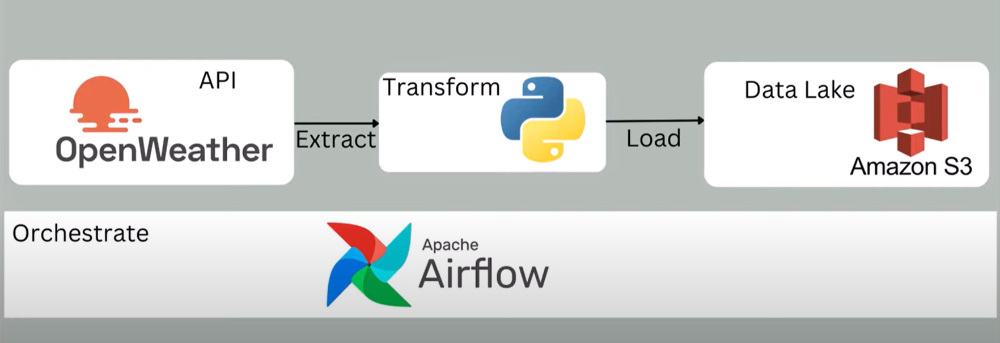

Built and Automate python ETL pipeline with Airflow on AWS EC2

Create a ETL pipeline with python where it extracts data from openweathemap and transform the data into CSV format and load the Data into AWS S3 bucket.

